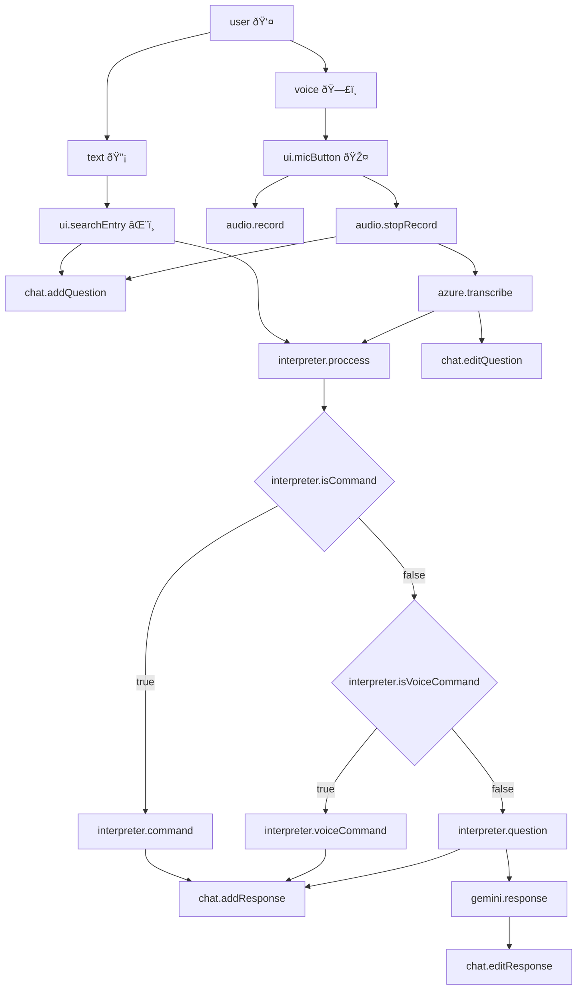

```mermaid
graph TD
    %% INPUT
    INPUT[user 👤] --> INPUT_TEXT
    INPUT --> INPUT_VOICE

    %% TEXT
    INPUT_TEXT[text  🔡] --> SEARCH_ENTRY[ui.searchEntry ⌨ï¸]
    SEARCH_ENTRY --> ADD_QUESTION[chat.addQuestion]
    SEARCH_ENTRY --> PROCCESS[interpreter.proccess]

    %% VOICE
    INPUT_VOICE[voice 🗣ï¸] --> MIC_BUTTON[ui.micButton 🎤]
    MIC_BUTTON --> RECORD[audio.record]
    MIC_BUTTON --> STOP_RECORD[audio.stopRecord]

    %% Audio
    STOP_RECORD --> ADD_QUESTION
    STOP_RECORD --> TRANSCRIBE[azure.transcribe]

    %% Azure
    TRANSCRIBE --> EDIT_QUESTION[chat.editQuestion]
    TRANSCRIBE --> PROCCESS

    %% Interpreter
    PROCCESS --> IS_COMMAND{interpreter.isCommand}
    IS_COMMAND -- true --> COMMAND[interpreter.command] --> ADD_RESPONSE[chat.addResponse]
    IS_COMMAND -- false --> IS_VOICE_COMMAND{interpreter.isVoiceCommand}
    IS_VOICE_COMMAND -- true --> VOICE_COMMAND[interpreter.voiceCommand] --> ADD_RESPONSE
    IS_VOICE_COMMAND -- false --> QUESTION[interpreter.question] --> ADD_RESPONSE

    %% Gemini
    QUESTION --> RESPONSE[gemini.response] --> EDIT_RESPONSE[chat.editResponse]
```
