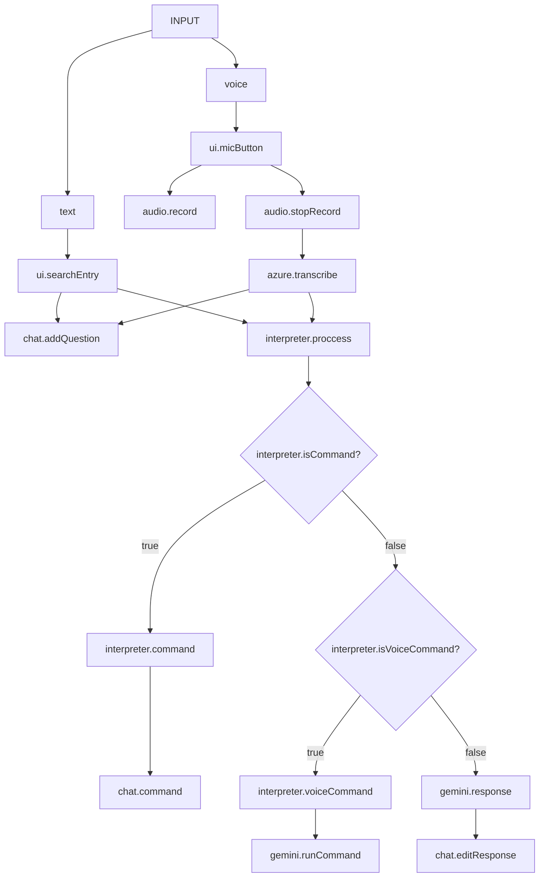

```mermaid
graph TD
    %% INPUT
    INPUT[INPUT] --> TEXTENTRY
    INPUT --> VOICEENTRY

    %% TEXT
    TEXTENTRY[text] --> A[ui.searchEntry]
    A --> B[chat.addQuestion]
    A --> C[interpreter.proccess]

    %% VOICE
    VOICEENTRY[voice] --> D[ui.micButton]
    D --> E[audio.record]
    D --> F[audio.stopRecord]

    %% Audio
    F --> G[azure.transcribe]
    G --> B
    G --> C

    %% Interpreter
    C --> H{interpreter.isCommand?}
    H -- true --> I[interpreter.command] --> J[chat.command]
    H -- false --> K{interpreter.isVoiceCommand?}
    K -- true --> L[interpreter.voiceCommand] --> M[gemini.runCommand]
    K -- false --> N[gemini.response] --> O[chat.editResponse]
```
