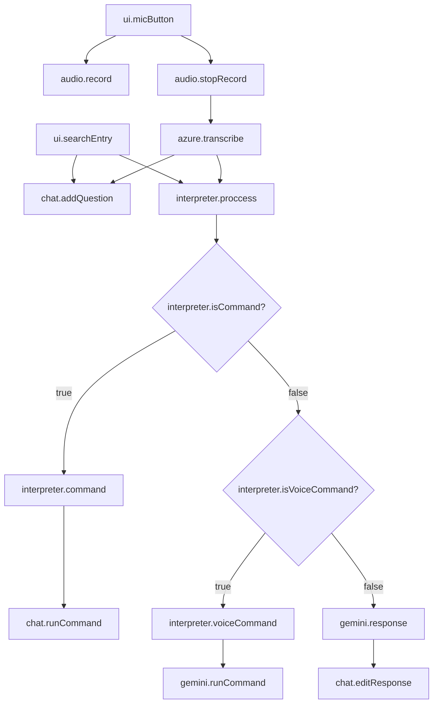

```mermaid
graph TD
    %% Text Entry
    A[ui.searchEntry] --> B[chat.addQuestion]
    A --> C[interpreter.proccess]

    %% Voice Entry
    D[ui.micButton] --> E[audio.record]
    D --> F[audio.stopRecord]

    %% Audio
    F --> G[azure.transcribe]
    G --> B
    G --> C

    %% Interpreter
    C --> H{interpreter.isCommand?}
    H -- true --> I[interpreter.command] --> J[chat.runCommand]
    H -- false --> K{interpreter.isVoiceCommand?}

    K -- true --> L[interpreter.voiceCommand] --> M[gemini.runCommand]
    K -- false --> N[gemini.response] --> O[chat.editResponse]
```
