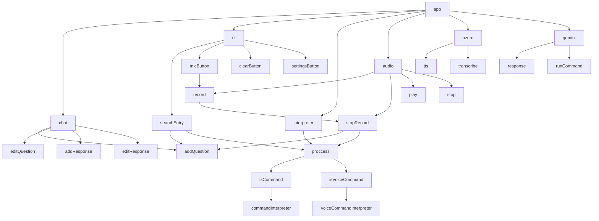

```mermaid
graph TD
    A[app] --> B[chat]
    A[app] --> C[ui]
    A[app] --> D[interpreter]
    A[app] --> E[audio]
    A[app] --> F[azure]
    A[app] --> G[gemini]
    B --> B1[addQuestion]
    B --> B2[editQuestion]
    B --> B3[addResponse]
    B --> B4[editResponse]
    C --> C1[searchEntry]
    C --> C2[micButton]
    C --> C3[clearButton]
    C --> C4[settingsButton]
    D --> D1[proccess]
    D1 --> D2[isCommand]
    D1 --> D3[isVoiceCommand]
    D2 --> D4[commandInterpreter]
    D3 --> D5[voiceCommandInterpreter]
    E --> E1[record]
    E --> E2[stopRecord]
    E --> E3[play]
    E --> E4[stop]
    F --> F1[tts]
    F --> F2[transcribe]
    G --> G1[response]
    G --> G2[runCommand]
    C1 --> B1
    C1 --> D1
    C2 --> E1
    E1 --> E2
    E2 --> B1
    E2 --> D1
```
