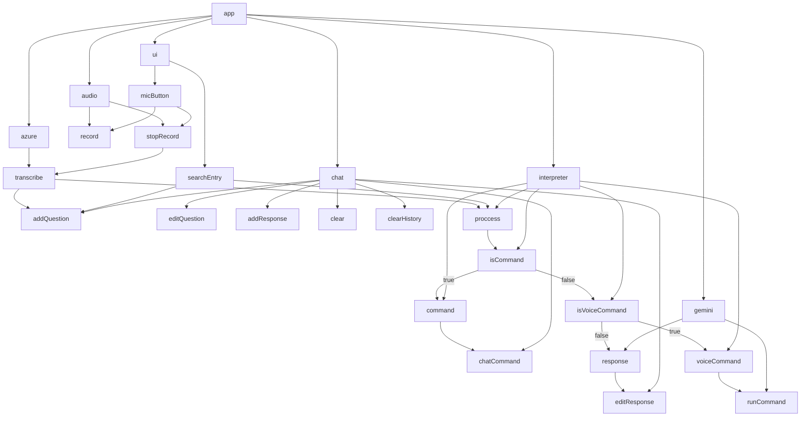

```mermaid
graph TD
    %% App
    APP[app] --> UI[ui]
    APP[app] --> CHAT[chat]
    APP[app] --> INTERPRETER[interpreter]
    APP[app] --> AUDIO[audio]
    APP[app] --> AZURE[azure]
    APP[app] --> GEMINI[gemini]

    %% UI
    UI --> SEARCHENTRY[searchEntry]
    UI --> MICBUTTON[micButton]
    MICBUTTON --> RECORD
    MICBUTTON --> STOPRECORD

    %% CHAT
    CHAT --> ADDQUESTION[addQuestion]
    CHAT --> EDITQUESTION[editQuestion]
    CHAT --> ADDRESPONSE[addResponse]
    CHAT --> EDITRESPONSE[editResponse]
    CHAT --> CHATCOMMAND[chatCommand]
    CHAT --> CLEAR[clear]
    CHAT --> CLEARHISTORY[clearHistory]

    %% INTERPRETER
    INTERPRETER --> PROCCESS[proccess]
    INTERPRETER --> ISCOMMAND[isCommand]
    INTERPRETER --> ISVOICECOMMAND[isVoiceCommand]
    INTERPRETER --> COMMAND[command]
    INTERPRETER --> VOICECOMMAND[voiceCommand]

    %% AUDIO
    AUDIO --> RECORD[record]
    AUDIO --> STOPRECORD[stopRecord]
    STOPRECORD --> TRANSCRIBE

    %% AZURE
    AZURE --> TRANSCRIBE[transcribe]

    %% GEMINI
    GEMINI --> RUNCOMMAND[runCommand]
    GEMINI --> RESPONSE[response]

    SEARCHENTRY --> ADDQUESTION
    SEARCHENTRY --> PROCCESS


    TRANSCRIBE --> ADDQUESTION
    TRANSCRIBE --> PROCCESS

    PROCCESS --> ISCOMMAND
    ISCOMMAND -- true --> COMMAND --> CHATCOMMAND
    ISCOMMAND -- false --> ISVOICECOMMAND

    ISVOICECOMMAND -- true --> VOICECOMMAND --> RUNCOMMAND
    ISVOICECOMMAND -- false --> RESPONSE --> EDITRESPONSE
```
