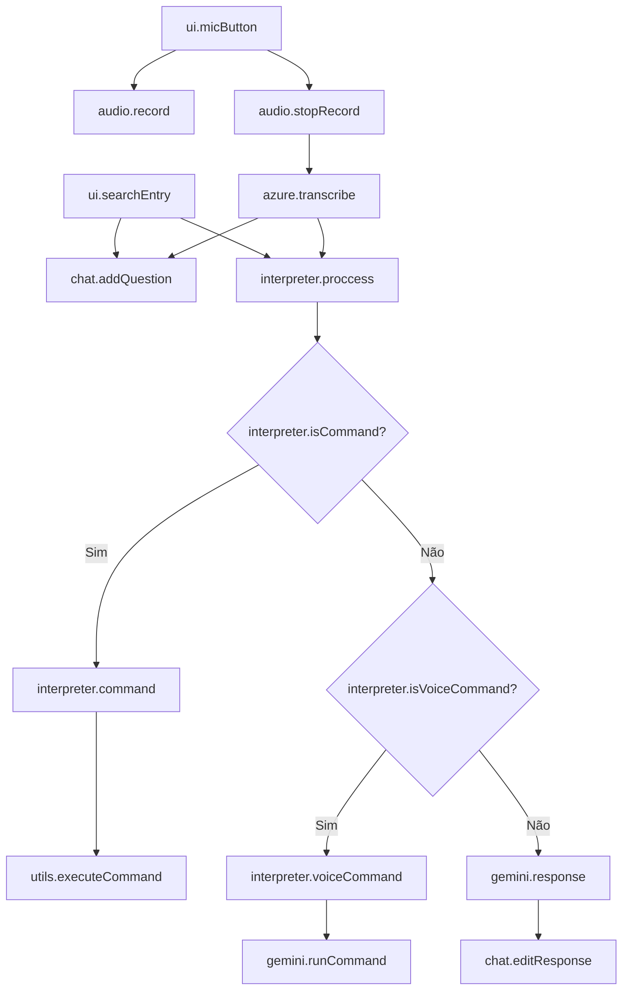

```mermaid
graph TD
    %% Entradas principais
    A[ui.searchEntry] --> B[chat.addQuestion]
    A --> C[interpreter.proccess]

    D[ui.micButton] --> E[audio.record]
    D --> F[audio.stopRecord]

    %% Fluxo de processamento de áudio
    F --> G[azure.transcribe]
    G --> B
    G --> C

    %% Fluxo de interpretação
    C --> H{interpreter.isCommand?}
    H -- Sim --> I[interpreter.command] --> J[utils.executeCommand]
    H -- Não --> K{interpreter.isVoiceCommand?}

    K -- Sim --> L[interpreter.voiceCommand] --> M[gemini.runCommand]
    K -- Não --> N[gemini.response] --> O[chat.editResponse]
```
