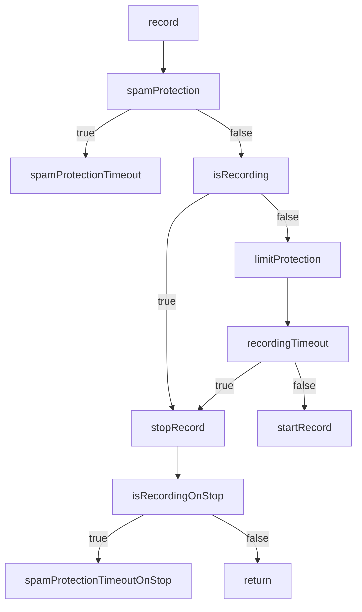

```mermaid
graph TD
    %% RECORD
    record --> spamProtection
    spamProtection -- true --> spamProtectionTimeout
    spamProtection -- false --> isRecording
    isRecording -- true --> stopRecord
    isRecording -- false --> limitProtection
    limitProtection --> recordingTimeout
    recordingTimeout -- true --> stopRecord
    recordingTimeout -- false --> startRecord

    %% STOP RECORD
    stopRecord --> isRecordingOnStop
    isRecordingOnStop -- true --> spamProtectionTimeoutOnStop
    isRecordingOnStop -- false --> return


```
